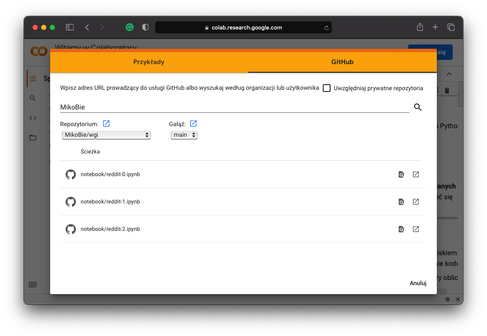

# `Reddit 101`: A short tutorial on how to scrape data from Reddit

This is a very basic tutorial on scraping data from [Reddit](reddit.com). Although it is written in _python_ it does not require knowing it very well. The tutorial was created for people who will run the interactive notebooks in `Google Colab` but obviously it is possible to use it in `Jupyter Notebook`. However, the latter requires being a more advanced user who knows how to install packages on their local machine. 

## Google Colab

Users who want to use the tutorial online in `Google Colab` should follow these steps to access these interactive notebooks:

1. Go to [www.colab.research.google.com](https://colab.research.google.com/) (it is better to have a Google Account but not necessary).
2. Press GitHub in the popup window or press File and Open notebook.
3. Type `MikoBie` in the search box (compare the picture below).

4. Choose a relevant notebook and click Open Notebook.

That is it, an interactive notebook should open.

## Jupyter Notebook

For more advanced users I recommend running this tutorial on their local machines. In the long shot, it will allow scraping more data because even though downloading a lot of data through `Jupyter Notebook` is an ill idea at least the environment for more advanced queries would be already created.
### Main Dependencies

* python3.9 ([anaconda distribution](https://www.anaconda.com/download/) is preferred)
* other _python_ dependencies are specified in `requirenments.txt`

### Setup

1. Clone the repo: [git@github.com:MikoBie/wgi.git](git@github.com:MikoBie/wgi.git)
2. Set up the proper virtual environment with python3.9
3. Install all the dependencies from `requirenments.txt`

